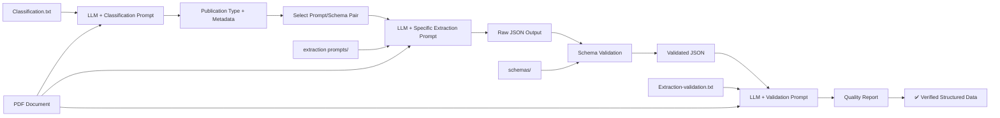

# Extraction Prompts - Schema-Specific Versions

## Overview

Based on analysis of the 5 bundled JSON schemas, specialized extraction prompts have been created for each study type. The original single prompt was designed only for interventional trials and was incompatible with other schema structures. These optimized prompts provide schema-specific validation rules and are optimized for efficient language model processing.

Additionally, a universal quality assurance prompt (`Extraction-validation.txt`) systematically verifies extracted data against PDF sources for accuracy and completeness.

## 🔗 Schema-Prompt Integration

These extraction prompts are part of a **four-component system** that works together with classification, JSON schemas and quality verification:

### Four-Component Framework

| Component | Location | Purpose | Use |
|-----------|----------|---------|-----|
| **Classification** | `Classification.txt` | Identify publication type & extract metadata | Pre-process PDF to select appropriate extraction approach |
| **Extraction Prompts** | `prompts/` folder (HERE) | Guide LLMs to extract structured data | Feed to language models with PDFs |
| **JSON Schemas** | `schemas/` folder | Define structure and validation rules | Validate extracted JSON output |
| **Quality Verification** | `Extraction-validation.txt` | Verify accuracy and completeness | Cross-check extraction against PDF source |

### How They Work Together



### Critical Integration Points

- **Schema Compatibility**: Each prompt is designed for its corresponding bundled schema
- **Field Alignment**: Prompts enforce exact schema field names and structures
- **Validation Requirements**: Prompts include schema-specific validation rules
- **Output Format**: Prompts ensure JSON output matches schema expectations

**⚠️ Important**: Always use prompts WITH their corresponding schemas. Using prompts alone without validation can result in unreliable data extraction.

### 📁 Project Context

This prompts folder is part of a larger medical literature extraction framework:

```
PDFtoPodcast/
├── prompts/                          # ← YOU ARE HERE
│   ├── Classification.txt                      # Publication type classifier
│   ├── Extraction-prompt-interventional.txt    # LLM extraction prompts
│   ├── Extraction-prompt-observational.txt     # (5 specialized prompts)
│   ├── Extraction-prompt-evidence-synthesis.txt
│   ├── Extraction-prompt-prediction.txt
│   ├── Extraction-prompt-editorials.txt
│   ├── Extraction-validation.txt               # Quality verification prompt
│   └── README.md                               # This guide
│
├── schemas/                          # ← COMPANION FOLDER
│   ├── *_bundled.json              # Production validation schemas
│   ├── *.schema.json              # Development schemas
│   └── README.md                   # Schema documentation & integration guide
│
└── json-bundler.py                  # Tool to create standalone schemas
```

**🔗 For complete integration guidance**: See the comprehensive [`schemas/README.md`](../schemas/README.md) which includes:
- LLM integration patterns and code examples
- Token optimization metrics and best practices
- Production deployment guidelines
- Microservice architecture patterns

## Classification System

### `Classification.txt` - Publication Type Identification

**Purpose**: Pre-processing step that automatically identifies publication type and extracts metadata to enable Python script selection of the appropriate extraction prompt/schema combination.

**Six Publication Categories**:
1. **`interventional_trial`** - RCTs, cluster-RCTs, crossover trials, before-after studies
2. **`observational_analytic`** - Cohort studies, case-control studies, cross-sectional analyses
3. **`evidence_synthesis`** - Systematic reviews, meta-analyses, network meta-analyses
4. **`prediction_prognosis`** - Prediction models, prognostic studies, ML/AI algorithms
5. **`editorials_opinion`** - Editorials, commentaries, opinion pieces, letters
6. **`overig`** - Case reports, case series, narrative reviews, guidelines, technical reports

**Classification Algorithm**:
1. **Explicit design search**: Look for study design labels in Methods section
2. **Primary characteristics**: Identify intervention, systematic search, predictors, exposure-outcome relationships
3. **Domain expertise**: Apply anesthesiology-specific rules (perioperative care → interventional, pain management cohorts → observational)
4. **Confidence assessment**: Score based on clarity of design indicators (0.95-1.0 for clear labels, 0.4-0.59 for difficult classifications)
5. **Alternative classification**: List potential alternatives when confidence < 0.9

**Key Features**:
- **Automated metadata extraction**: Title, authors, journal, DOI, PMID, Vancouver citation with complete bibliographic details
- **Early publication handling**: Detects and handles online-first articles without volume/issue, adds appropriate warnings
- **Evidence-locked extraction**: Only uses PDF content including main text, tables, figures; no external knowledge
- **Confidence scoring**: 0.0-1.0 reliability score for classification decisions with detailed reasoning
- **Error handling**: Structured warnings for PDF parsing issues, ambiguous designs, missing metadata
- **Vancouver citations**: Full compliance with Vancouver referencing style including author formatting rules
- **Python integration**: Clean JSON output enables automated prompt/schema selection

**Metadata Extraction Priority**:
- **Main text first**: Title page/header > Methods > Results > References > Abstract
- **Complete information**: Full author lists with affiliations, complete journal information
- **Source tracking**: Page references and anchor descriptions for all extracted metadata

**Anesthesiology Specialization**:
- Perioperative care studies → interventional_trial
- Pain management cohorts → observational_analytic
- Anesthesia technique comparisons → interventional_trial
- Outcome prediction models → prediction_prognosis
- Practice guideline commentaries → editorials_opinion
- Case series of complications → overig

**Output Format**:
```json
{
  "metadata": {
    "title": "string (required)",
    "journal": "string (required)",
    "authors": [{"given_name": "", "family_name": "", "initials": ""}],
    "vancouver_citation": "string (required)",
    "published_date": "YYYY-MM-DD",
    "volume": "string", "issue": "string", "pages": "string",
    "doi": "string", "pmid": "string",
    "source": {"page": "number", "anchor": "location description"}
  },
  "publication_type": "interventional_trial|observational_analytic|evidence_synthesis|prediction_prognosis|editorials_opinion|overig",
  "classification_confidence": 0.95,
  "classification_reasoning": "Clear RCT design with randomization mentioned in Methods",
  "alternative_classifications": ["array if confidence < 0.9"],
  "extraction_warnings": [
    {
      "warning": "Early online publication - volume/issue not yet assigned",
      "source": {"page": 1, "anchor": "Article header"}
    }
  ]
}
```

## Created Files

### 1. `Extraction-prompt-interventional.txt`
- **Schema**: `interventional_trial_bundled.json`
- **Key Fields**: `arms`, `interventions`, `results.per_arm`, `results.contrasts`
- **Validation**: Focuses on randomization, n_randomised, primary outcomes
- **Use Case**: RCTs, cluster-RCTs, crossover trials, factorial designs

### 2. `Extraction-prompt-observational.txt`
- **Schema**: `observational_analytic_bundled.json`
- **Key Fields**: `exposures`, `groups`, `results.per_group`, `results.contrasts`
- **Validation**: Exposure groups, confounding assessment, causal inference
- **Use Case**: Cohort studies, case-control studies, cross-sectional analyses

### 3. `Extraction-prompt-evidence-synthesis.txt`
- **Schema**: `evidence_synthesis_bundled.json`
- **Key Fields**: `review_type`, `eligibility`, `search`, `prisma_flow`, `syntheses`
- **Validation**: PICO criteria, search strategy, meta-analysis results
- **Use Case**: Systematic reviews, meta-analyses, network meta-analyses, umbrella reviews

### 4. `Extraction-prompt-prediction.txt`
- **Schema**: `prediction_prognosis_bundled.json`
- **Key Fields**: `predictors`, `datasets`, `models`, `performance`
- **Validation**: Model development vs validation, EPV, discrimination metrics
- **Use Case**: Prediction models, prognostic studies, ML/AI algorithms

### 5. `Extraction-prompt-editorials.txt`
- **Schema**: `editorials_opinion_bundled.json`
- **Key Fields**: `article_type`, `stance_overall`, `arguments`
- **Validation**: Argument structure, stakeholder analysis, rhetorical assessment
- **Use Case**: Editorials, commentaries, opinion pieces, letters, perspectives

### 6. `Extraction-validation.txt`
- **Purpose**: Universal quality assurance for all extraction types
- **Input**: Extracted JSON + PDF content + Schema
- **Output**: Structured quality report with scores and recommendations
- **Key Features**: Hallucination detection, completeness scoring, accuracy verification
- **Use Case**: Quality control for all extracted data regardless of study type

## Shared Elements

All prompts maintain these common standards:
- **Evidence-locked rules**: Only extract from PDF content, no external knowledge
- **Data Source Prioritering**: Main text (Methods/Results/Discussion) prioriteit boven abstract voor completere extractie
- **SourceRef requirements**: Precise page/table/figure references with anchor context
- **Vancouver citation**: Consistent bibliographic formatting with source attribution
- **Token fallback**: Graceful handling of large documents with truncation warnings
- **Anesthesiology focus**: Domain-specific details when present (ASA, procedures, PONV, etc.)
- **Schema validation**: Strict adherence to required fields per schema type
- **Plain text format**: Optimized for LLM processing (markdown formatting removed)

## Data Source Prioritering (v2.3 Update)

### Hoofdtekst Eerst Strategie
Alle 5 extractie prompts zijn geüpdatet met expliciete instructies om data bij voorkeur uit de hoofdtekst te halen:

#### Prioriteitsrangorde
1. **Results secties** - Primaire bron voor numerieke data, effect sizes, sample sizes
2. **Methods secties** - Voor complete metodologie, inclusie/exclusie criteria
3. **Discussion secties** - Voor context, limitations, clinical implications
4. **Tables/Figures** - Voor gedetailleerde resultaten en baseline characteristics
5. **Abstract** - Alleen voor verificatie of als hoofdtekst onduidelijk is

#### Probleem Opgelost
**Voor**: Extracties focusten vaak te veel op abstract, misten details uit volledige Results tabellen
**Na**: Systematische prioritering van volledige Methods/Results secties verbetert completeness scores

### Sectie-Specifieke Instructies per Prompt Type

#### Interventional Studies
- CONSORT flow uit figuren/Methods, niet abstract N-vermeldingen
- Sample sizes uit Methods "Participants" of Results "Flow diagram"
- Effect sizes uit results tabellen met CI's en p-waarden
- Adverse events uit dedicated safety tabellen/Results subsecties

#### Observational Studies
- Exposure groups uit Methods "Exposure definition" en Results tabellen
- Confounding adjustment uit statistical methods sectie
- Follow-up details uit Methods "Data collection" sectie
- Complete baseline characteristics uit tabellen

#### Evidence Synthesis
- Search strategy uit Methods "Literature Search" sectie
- PRISMA flow uit dedicated flow diagram en Methods
- Study characteristics uit results tabellen en appendices
- Quality of evidence uit GRADE tabellen en assessment details

#### Prediction Studies
- Model performance uit Results "Model Performance" tabellen
- Predictors uit Methods "Variable Selection" en Results coefficient tabellen
- C-statistics/AUC uit Results performance tabellen met confidence intervals
- Validation uit Results "External Validation" secties

#### Editorials
- Arguments uit hoofdtekst paragrafen met specifieke claims
- Evidence citations uit Discussion met volledige referenties
- Recommendations uit dedicated Recommendations/Conclusion secties
- Counterarguments uit Discussion nuance en limitations

## Key Structural Differences

| Schema Type | Primary Structure | Results Format | Special Features |
|-------------|------------------|----------------|------------------|
| Interventional | Arms → Outcomes | per_arm + contrasts | Randomization, harms |
| Observational | Exposures → Groups | per_group + contrasts | Confounding, DAGs |
| Evidence Synthesis | Studies → Syntheses | pooled + per_study | PRISMA, heterogeneity |
| Prediction | Predictors → Models | performance metrics | C-statistic, calibration |
| Editorials | Arguments → Stance | narrative analysis | Rhetorical structure |

## Prompt Optimization

### Language Model Efficiency
All prompts have been optimized for efficient language model processing:

- **Markdown cleanup**: Removed all `**bold**`, `*bullet*` formatting for ~15-25% token reduction
- **Plain text structure**: Clean hierarchical organization with line breaks and numbered lists
- **Code preservation**: Maintained `` `backticks` `` for JSON field names and technical terms
- **Content integrity**: All instructions and validation rules preserved without information loss

### Trade-offs
- **LLM processing**: Optimized for language model efficiency and focus
- **Human readability**: Reduced visual formatting but maintained logical structure
- **Token cost**: Significant reduction in API token usage
- **Maintenance**: Simpler text format for easier updates and version control

## Usage Recommendations

### Study Type Identification
Select the appropriate prompt based on study type identification:
1. **Identify study design** from title/abstract/methods section
2. **Match to schema type** using the structural differences table
3. **Use corresponding prompt** for extraction
4. **Validate output** against the specific bundled schema

### Performance Guidelines
- **Token limits**: Each prompt ~2000-3000 tokens (post-optimization)
- **Fallback handling**: Prompts include truncation warnings for large documents
- **Error handling**: Built-in extraction warnings for ambiguous content
- **Quality assurance**: Schema-specific validation rules prevent common errors

## Implementation Notes

### Schema Compatibility
- **Validation mapping**: Each prompt validated against its corresponding bundled schema
- **Required fields**: Schema-specific required fields enforced (e.g., `arms` for trials, `exposures` for observational)
- **Field constraints**: Type-specific validation (e.g., `n_randomised` only for interventional studies)
- **Output format**: Single valid JSON objects without additional text or explanations

### Methodological Frameworks
- **Interventional**: RoB 2.0, CONSORT, TIDieR guidelines integration
- **Observational**: ROBINS-I, ROBINS-E, STROBE extensions, DAG methodology
- **Evidence Synthesis**: AMSTAR 2, ROBIS, CINeMA, GRADE assessment
- **Prediction**: PROBAST, TRIPOD-AI, CHARMS checklist compliance
- **Editorials**: Rhetorical analysis, stakeholder identification, bias assessment

### Technical Specifications
- **Evidence-locked**: Strict PDF-only extraction, no external knowledge injection
- **SourceRef consistency**: Page, table, figure references with contextual anchors
- **Vancouver citations**: Automated bibliographic string generation with source tracking
- **Error handling**: Structured `extraction_warnings[]` for ambiguous content

## Quality Assurance Framework

### Extraction-validation.txt Features
- **Universal compatibility**: Works with all 5 study types and schemas
- **Systematic verification**: Hallucination detection, completeness scoring, accuracy assessment
- **Structured output**: JSON format with severity levels and actionable recommendations
- **Python integration**: Machine-readable quality reports for automated pipelines
- **Evidence-based scoring**: Completeness, accuracy, and schema compliance metrics

### Quality Metrics
- **Completeness Score**: (Extracted relevant data / Total available PDF data)
- **Accuracy Score**: (Correctly extracted values / Total extracted values)
- **Schema Compliance**: (Valid fields / Total schema-required fields)
- **Overall Status**: Passed/Warning/Failed based on combined thresholds

### Automated Quality Gates
```python
# Example quality thresholds for production use
QUALITY_THRESHOLDS = {
    'passed': {'completeness': 0.90, 'accuracy': 0.95, 'compliance': 1.0},
    'warning': {'completeness': 0.80, 'accuracy': 0.90, 'compliance': 0.95},
    'failed': 'below_warning_thresholds'
}
```

## Version History

### v2.3 (Current) - September 2025
- **Data Source Prioritering**: Hoofdtekst prioriteit toegevoegd aan alle 5 extractie prompts
- **Sectie-specifieke instructies**: Methods/Results/Tables prioriteit boven abstract
- **Completeness verbetering**: Verwachte verbetering van completeness scores door volledige sectie extractie
- **Evidence-locked enhancement**: Uitgebreide instructies voor systematische hoofdtekst extractie

### v2.2 - September 2025
- **Quality assurance**: Added Extraction-validation.txt for systematic verification
- **Three-component system**: Extract → Validate → Verify pipeline
- **Python integration**: Complete quality control examples and batch processing

### v2.1 - September 2025
- **Markdown cleanup**: Removed formatting for LLM optimization
- **Token reduction**: 15-25% efficiency improvement
- **Content preservation**: All functionality maintained

### v2.0 - September 2025
- **Schema specialization**: Created 5 schema-specific prompts
- **Original assessment**: Single prompt incompatible with 4/5 schemas
- **Validation rules**: Adapted per study type requirements
- **Structural alignment**: Matched prompt structure to schema requirements

### v1.0 - Previous
- **Original prompt**: Single interventional trial focused prompt
- **Limited scope**: Only compatible with interventional_trial schema

## 🚀 Quick Start - Complete Extraction Pipeline

### Essential Four-Step Process
**Step 1**: Classify publication type → **Step 2**: Extract with prompt → **Step 3**: Validate with schema → **Step 4**: Verify with validation prompt

### Complete Workflow
```
1. Classify: Use Classification.txt to identify publication type and extract metadata
   - Input: PDF document
   - Output: Publication type + metadata + confidence score
   - Handle: Early publications, PDF parsing issues, ambiguous designs

2. Select: Python script chooses appropriate prompt/schema pair based on classification
   - Skip extraction if classification type is "overig" (no specialized schema available)
   - Load corresponding extraction prompt and bundled schema
   - Load universal validation prompt

3. Get FOUR components:
   Classification: Classification.txt                    (from prompts/ folder)
   Extraction: Extraction-prompt-[type].txt            (from prompts/ folder)
   Schema: [type]_bundled.json                         (from schemas/ folder)
   Validation: Extraction-validation.txt               (from prompts/ folder)

4. Extract: Use specific extraction prompt with PDF input in your LLM
   - Apply evidence-locked rules (PDF content only)
   - Prioritize main text over abstract for completeness
   - Include source references for all extracted data

5. Validate: ALWAYS validate JSON output against bundled schema
   - Catch structural errors and missing required fields
   - Ensure type compatibility and field constraints
   - 80%+ of extraction errors caught at this stage

6. Verify: Use validation prompt with JSON + PDF + Schema for quality check
   - Detect hallucinations and inaccuracies
   - Score completeness and accuracy
   - Generate structured quality report with recommendations

7. ✅ Result: Verified, high-quality structured medical literature data
   - Passed quality gates with measurable metrics
   - Ready for critical appraisal (CASP/RoB 2.0/ROBINS-I/AMSTAR 2)
   - Suitable for systematic reviews and meta-analyses
```

### Schema-Prompt Pairs (MUST use together)
| Study Type | Extraction Prompt | Validation Schema | Required |
|------------|-------------------|------------------|----------|
| **RCT/Trial** | `Extraction-prompt-interventional.txt` | `interventional_trial_bundled.json` | ✅ |
| **Cohort/Case-control** | `Extraction-prompt-observational.txt` | `observational_analytic_bundled.json` | ✅ |
| **Meta-analysis/Review** | `Extraction-prompt-evidence-synthesis.txt` | `evidence_synthesis_bundled.json` | ✅ |
| **Prediction model** | `Extraction-prompt-prediction.txt` | `prediction_prognosis_bundled.json` | ✅ |
| **Editorial/Opinion** | `Extraction-prompt-editorials.txt` | `editorials_opinion_bundled.json` | ✅ |

### 💡 Why All Four Components Are Required
- **Classification alone**: Can identify type and metadata, but no detailed extraction
- **Extraction prompt alone**: Can extract data, but no guarantee of structure or completeness
- **Schema alone**: Can validate structure, but can't extract from PDFs
- **Validation prompt alone**: Can verify quality, but needs extracted data first
- **Together**: Complete pipeline with classification, extraction, validation, and quality assurance

### 💻 Integration Examples

#### Python Example: Complete 4-Step Extraction Pipeline
```python
import json
import jsonschema

# 1. Classify publication type
classification_prompt = open('prompts/Classification.txt').read()
pdf_text = extract_text_from_pdf('study.pdf')
classification_input = classification_prompt + "\n\n" + pdf_text
classification_output = your_llm.generate(classification_input)
classification_data = json.loads(classification_output)

publication_type = classification_data['publication_type']
if publication_type == 'overig':
    print("❌ Publication type 'overig' - no extraction prompt available")
    return None

# 2. Load appropriate components based on classification
prompt_mapping = {
    'interventional_trial': ('Extraction-prompt-interventional.txt', 'interventional_trial_bundled.json'),
    'observational_analytic': ('Extraction-prompt-observational.txt', 'observational_analytic_bundled.json'),
    'evidence_synthesis': ('Extraction-prompt-evidence-synthesis.txt', 'evidence_synthesis_bundled.json'),
    'prediction_prognosis': ('Extraction-prompt-prediction.txt', 'prediction_prognosis_bundled.json'),
    'editorials_opinion': ('Extraction-prompt-editorials.txt', 'editorials_opinion_bundled.json')
}

prompt_file, schema_file = prompt_mapping[publication_type]
extraction_prompt = open(f'prompts/{prompt_file}').read()
validation_prompt = open('prompts/Extraction-validation.txt').read()
schema = json.load(open(f'schemas/{schema_file}'))

# 3. Extract with LLM using selected prompt
llm_input = extraction_prompt + "\n\n" + pdf_text
json_output = your_llm.generate(llm_input)

# 3. Parse and validate schema
try:
    extracted_data = json.loads(json_output)
    jsonschema.validate(extracted_data, schema)
    print("✅ Extraction successful and schema validated!")
except (json.JSONDecodeError, jsonschema.ValidationError) as e:
    print(f"❌ Schema validation error: {e}")
    return None

# 4. Quality verification
verification_input = f"""
EXTRACTED_JSON: {json.dumps(extracted_data, indent=2)}

PDF_CONTENT: {pdf_text}

SCHEMA: {json.dumps(schema, indent=2)}
"""
quality_report = your_llm.generate(validation_prompt + "\n\n" + verification_input)
quality_data = json.loads(quality_report)

# 5. Quality assessment with improved main text extraction
if quality_data['verification_summary']['overall_status'] == 'passed':
    print("✅ Quality verification passed with main text priority!")
    # Higher completeness scores now achievable with main text extraction
    if quality_data['verification_summary']['completeness_score'] >= 0.95:
        print("🎯 Excellent completeness achieved through systematic main text extraction")
    return extracted_data
elif quality_data['verification_summary']['overall_status'] == 'warning':
    print("⚠️ Quality verification has warnings - review recommendations")
    return extracted_data, quality_data['recommendations']
else:
    print("❌ Quality verification failed - extraction requires correction")
    return None, quality_data['issues']
```

#### Batch Processing Example with Quality Control
```python
def process_literature_batch(pdf_files, study_type, quality_threshold=0.9):
    # Schema-prompt mapping
    pairs = {
        'interventional': ('Extraction-prompt-interventional.txt',
                          'interventional_trial_bundled.json'),
        'observational': ('Extraction-prompt-observational.txt',
                         'observational_analytic_bundled.json'),
        'synthesis': ('Extraction-prompt-evidence-synthesis.txt',
                     'evidence_synthesis_bundled.json')
    }

    extraction_file, schema_file = pairs[study_type]
    extraction_prompt = open(f'prompts/{extraction_file}').read()
    validation_prompt = open('prompts/Extraction-validation.txt').read()
    schema = json.load(open(f'schemas/{schema_file}'))

    results = []
    quality_reports = []

    for pdf_file in pdf_files:
        # Extract, validate, and verify each PDF
        data, quality = extract_validate_verify(pdf_file, extraction_prompt,
                                               schema, validation_prompt)

        # Apply quality gate
        if quality['verification_summary']['accuracy_score'] >= quality_threshold:
            results.append(data)
        else:
            print(f"Quality gate failed for {pdf_file}: {quality['issues']}")

        quality_reports.append(quality)

    return results, quality_reports
```

### Integration Tips
- **API efficiency**: Use optimized prompts to reduce token costs
- **Schema validation**: ALWAYS validate against bundled schemas - this catches 80%+ of extraction errors
- **Quality verification**: Use validation prompt to catch hallucinations and missing data
- **Error handling**: Check both `extraction_warnings[]` and quality report issues
- **Prompt-schema pairing**: Never mix prompts and schemas from different study types
- **Quality gates**: Set minimum accuracy/completeness scores for automated pipelines
- **Fallback**: Handle `truncated: true` cases for large documents

### 🔗 Advanced Integration
For comprehensive integration patterns including microservice architectures, token optimization strategies, and production deployment guides, see the [`schemas/README.md`](../schemas/README.md) which provides detailed LLM integration documentation.

## Troubleshooting

### Common Issues
- **Schema validation errors**: Ensure using correct prompt for study type
- **Missing required fields**: Check PDF contains necessary information sections
- **Token limits**: Use fallback handling for large documents
- **Extraction warnings**: Review PDF quality and completeness

### Data Source Issues (v2.3)
- **Low completeness scores**: Ensure PDF has full Methods/Results sections accessible (not just abstract)
- **Missing secondary outcomes**: Check if Results tables are properly parsed vs abstract-only extraction
- **Incomplete baseline data**: Verify baseline characteristics tables are available in main text
- **Missing effect sizes**: Confirm Results section contains detailed statistical analyses beyond abstract summaries
- **Incomplete adverse events**: Ensure safety data is extracted from dedicated tables rather than brief abstract mentions

### Output Quality
- **SourceRef precision**: Verify page/table/figure references are accurate
- **Vancouver citations**: Ensure bibliographic information extracted correctly
- **Field mapping**: Confirm schema field names match prompt expectations
